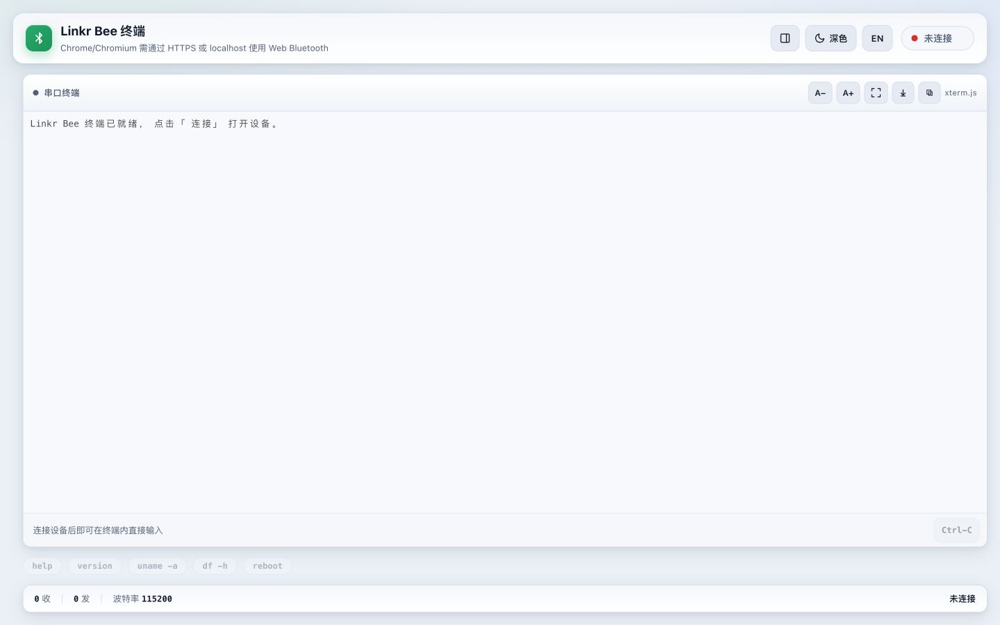
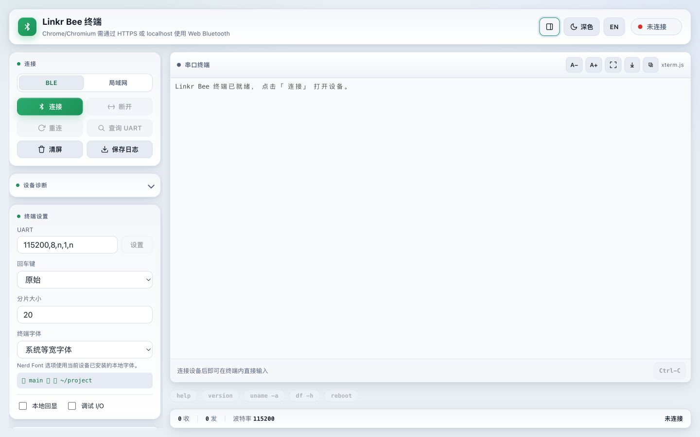
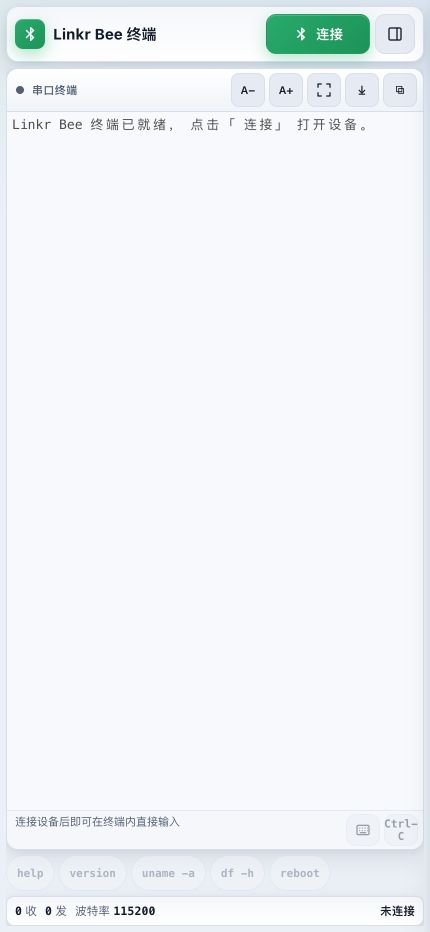

<p align="center">
  
</p>

<p align="center">
  A terminal-first Bluetooth LE and LAN serial bridge for Linkr.
</p>

<p align="center">
  <a href="README.zh-CN.md">中文</a> ·
  <a href="docs/README.md">Documentation</a> ·
  <a href="docs/DEVELOPMENT.md">Development guide</a>
</p>

Linkr Bee turns the UART console of an SBC or embedded target into a terminal
that can be reached from a browser, desktop computer, mobile device, or Linkr.
The accessory firmware runs on ESP32-C3 and ESP32-C5 with Zephyr and advertises
as `Linkr BLE UART-*`.

## Why Linkr Bee

UART is often the only dependable interface during board bring-up, bootloader
work, network failures, and recovery. Linkr Bee keeps that console available
without dedicating a USB serial cable and computer to the target.

| Scenario | What Linkr Bee provides |
| --- | --- |
| New-board bring-up | Wireless access to boot logs and the first interactive shell |
| Headless SBC operation | A local console when SSH or the network is unavailable |
| Field diagnosis | Terminal access from a phone, tablet, browser, or Linkr |
| Bench development | One UI for serial output, UART settings, diagnostics, and logs |
| Multiple accessories | Prefix-based discovery for devices named `Linkr BLE UART-*` |

Linkr Bee is a transport for the target UART. It does not replace the target
shell or inject a command environment of its own: the terminal displays and
sends the same byte stream that would normally pass through a wired adapter.

## Interface Overview



The terminal remains the primary workspace. Its height and width are kept
stable while connection state and serial output change, so long boot logs and
interactive programs remain readable.

### Connection and settings



Connection and device settings can be collapsed when they are not needed,
leaving more room for serial output.

- **Top bar:** connection state, quick connect, panel toggle, theme, and language.
- **Terminal:** xterm.js rendering, ANSI color, selection and copy, auto-scroll,
  font controls, fullscreen, and direct keyboard input.
- **Control panel:** BLE or LAN transport, UART parameters, line endings,
  diagnostics, WiFi, WebDAV, and log actions.
- **Command strip and status bar:** common Linux commands, RX/TX counters,
  baud rate, and live connection state.

### Phone and tablet layout

<p align="center">
  
</p>

On phones and tablets, the terminal takes over the available workspace while
secondary controls move into a drawer. The layout is designed to remain usable
with the on-screen keyboard visible.

## How It Works

```text
Browser / desktop / mobile / Linkr
                 │
          Bluetooth LE or LAN
                 │
        Linkr Bee accessory
          ESP32-C3 / ESP32-C5
                 │
             3.3 V UART
                 │
        SBC or embedded target
```

Terminal traffic and management traffic use separate GATT services. UART bytes
remain transparent, while UART configuration, WiFi setup, diagnostics, and
other accessory controls use a versioned request/response channel. This keeps
control messages out of the target console.

Reliable UART adds sequence tracking, confirmed indications, and reconnect
state to the BLE serial path. A legacy Nordic UART Service remains available
for clients that only need basic unframed forwarding.

## Connection Modes

| Mode | Best for | Requirements | Available controls |
| --- | --- | --- | --- |
| Bluetooth LE | Direct local access and first-time setup | BLE-capable host; Web Bluetooth requires Chrome/Chromium over HTTPS or localhost | Terminal, UART, WiFi, WebDAV, and diagnostics |
| LAN WebSocket | Reconnecting through an existing local network | Linkr Bee must already be connected to 2.4 GHz WiFi | Terminal data path |

BLE is the primary provisioning and recovery path because it does not depend on
the target or local network. LAN mode is an additional choice for established
installations, not a replacement for BLE.

## Capabilities

- BLE-to-UART and UART-to-BLE forwarding with a loss-detecting Reliable UART service.
- Configurable UART parameters for SBC boot consoles and interactive Linux shells.
- Web Bluetooth terminal for Chrome and Chromium on HTTPS or localhost.
- Native transport projects for Android, iOS, and HarmonyOS NEXT.
- Optional WiFi station control and UART-over-WebSocket access on the local network.
- Device diagnostics and optional WebDAV log upload.
- Legacy Nordic UART Service compatibility for existing clients.

### Terminal behavior

- Full ANSI/VT terminal rendering through xterm.js, including 256-color output.
- Raw, CR, LF, and CRLF Enter-key modes for different bootloaders and shells.
- Configurable font stack, font size, local echo, transfer chunk size, and I/O debug view.
- Selection copy, log export, auto-scroll control, fullscreen, and `Ctrl-C`.
- Quick-send commands for common Linux inspection tasks.

### Accessory management

- Read and change baud rate, data bits, parity, stop bits, and flow control.
- Scan and join nearby 2.4 GHz WiFi networks without sending credentials to the target UART.
- Query firmware, UART buffer, WiFi, upload queue, and bridge diagnostics.
- Upload captured logs to an explicitly configured WebDAV endpoint.
- Preserve accessory settings across normal restarts and provide a hardware factory-reset path.

## Supported Hardware

| Target | Role | Notes |
| --- | --- | --- |
| ESP32-C3 Super Mini | Primary compact reference board | UART on GPIO20/GPIO21; onboard blue LED shows UART activity |
| ESP32-C3 DevKitM / DevKitC | Development and integration boards | Supported by the Zephyr application and board overlays |
| ESP32-C5 DevKitC | WiFi 6-capable development target | Build target included; validate final memory and radio behavior on hardware |

The UART side is 3.3 V logic. Always share ground with the target and cross TX
to RX. Do not connect Linkr Bee directly to an RS-232 voltage-level interface.
See the [hardware requirements](docs/HARDWARE.md) before designing a custom board.

## Clients

| Client | Intended use | Status |
| --- | --- | --- |
| Web terminal | Chrome/Chromium desktop access | Available |
| Python terminal | macOS and Linux command-line access | Available |
| C terminal | Minimal-dependency Linkr/Buildroot integration | Available |
| Android and iOS | Native BLE transport with shared terminal UI | Projects included; real-device validation required |
| HarmonyOS NEXT | ArkUI/ArkWeb host with shared terminal UI | Emulator UI validated; BLE requires a real device |

All graphical clients share the same terminal and management behavior. Platform
projects supply the native BLE transport where Web Bluetooth is unavailable.

## Typical Workflow

1. Power Linkr Bee and the target, then connect crossed UART TX/RX and ground.
2. Open a client and select a device whose name begins with `Linkr BLE UART`.
3. Confirm that the UART format matches the target; `115200,8,n,1,n` is the default.
4. Reset or boot the target and observe its console output in the terminal.
5. Type directly in the terminal when the target presents a bootloader, login, or shell prompt.
6. Optionally configure WiFi and use LAN mode for later sessions.

The activity LED flashes when bytes pass through the bridge. If output appears
but input does not work, verify that target RX is connected to Linkr Bee TX and
that hardware flow control is disabled unless both CTS and RTS are wired.

## Getting Started

1. Flash a supported ESP32-C3 or ESP32-C5 board with the Linkr Bee firmware.
2. Connect the target UART TX, RX, and ground to the accessory.
3. Open one of the terminal clients and select a device named `Linkr BLE UART-*`.
4. Set the UART format to match the target, normally `115200,8,n,1,n`.

Build, flash, packaging, wiring, and client setup instructions are kept in the
[development guide](docs/DEVELOPMENT.md).

## Compatibility Notes

- Device selection matches the `Linkr BLE UART` prefix, so numeric or deployment-specific suffixes are accepted.
- The default terminal format is `115200,8,n,1,n`: 115200 baud, 8 data bits, no parity, 1 stop bit, no flow control.
- Web Bluetooth is intended for Chrome and Chromium. Safari and Firefox do not provide the required browser API.
- iOS simulators cannot validate BLE; Android, iOS, and HarmonyOS BLE behavior must be accepted on physical devices.
- WiFi provisioning is limited to 2.4 GHz networks in the current firmware.
- WebDAV upload is optional and should only be enabled for a trusted endpoint on a trusted network.

## Project Status

- ESP32-C3 and ESP32-C5 firmware targets build under Zephyr 4.4.1.
- Desktop Web Bluetooth, Python, and C terminal paths are included.
- The responsive shared UI covers desktop, phone, and tablet layouts.
- Android and iOS projects are synchronized with the shared terminal UI but still require physical-device acceptance.
- The HarmonyOS API 26 HAP, ArkWeb UI, and bridge have been exercised in the emulator; BLE remains a real-device test boundary.

Build success, emulator startup, and host-side unit tests are not substitutes
for end-to-end UART and BLE validation on the intended hardware.

## Documentation

| Topic | Document |
| --- | --- |
| Documentation index | [docs/README.md](docs/README.md) |
| Build, flash, integration, and configuration | [Development guide](docs/DEVELOPMENT.md) |
| GATT and Reliable UART protocol | [BLE accessory API v1](docs/LINKR_BLE_API.zh-CN.md) |
| Board wiring and electrical requirements | [Hardware requirements](docs/HARDWARE.md) |
| Android and iOS client | [mobile/README.md](mobile/README.md) |
| HarmonyOS NEXT client | [harmonyos/README.md](harmonyos/README.md) |

## Security

The current firmware intentionally permits open BLE access and does not require
pairing or bonding. Treat Linkr Bee as a local physical-console accessory. Do
not expose it as a remote-administration interface until an ownership and
authorization model has been implemented.

## License

Licensed under the terms in [LICENSE](LICENSE).
