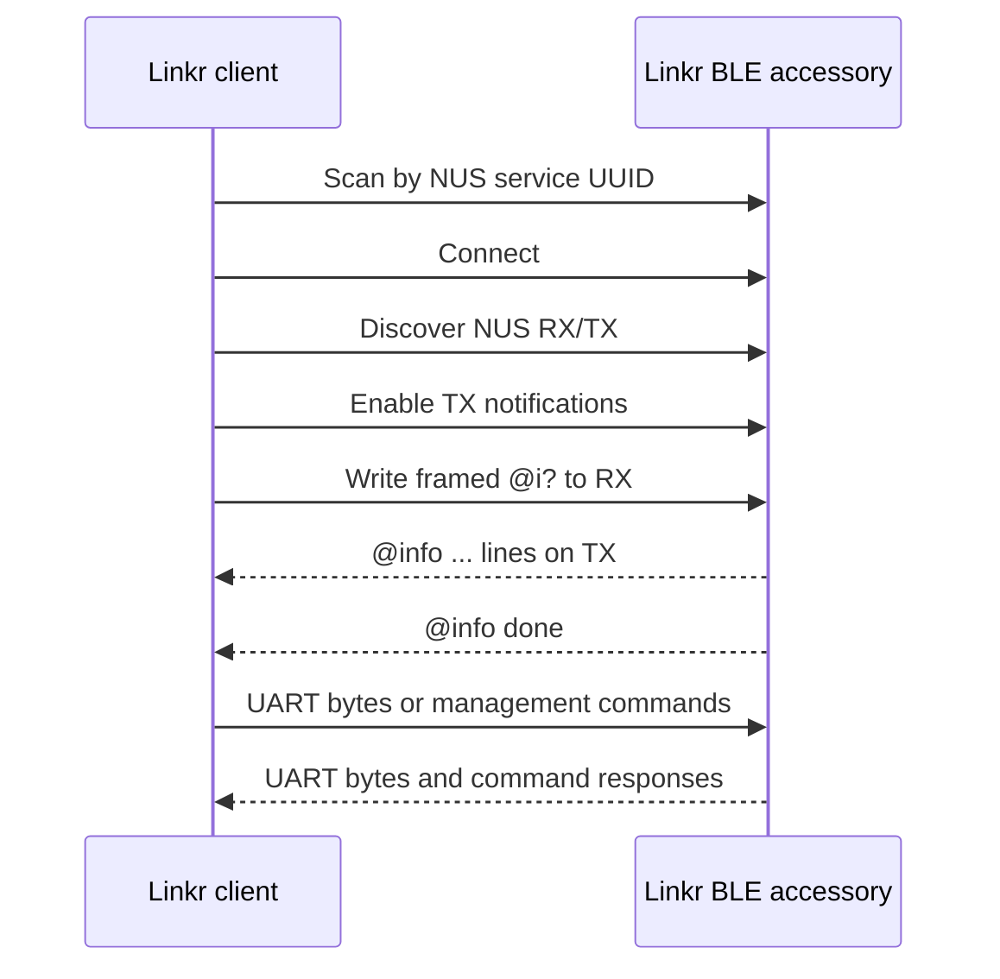

# Linkr BLE 配件 API 对接文档

本文档面向 Linkr 客户端、守护进程和上层应用开发者，描述 Linkr BLE
配件当前固件提供的 BLE GATT 接口、串口数据通道和管理命令协议。

## 1. 文档基线

| 项目 | 当前值 |
| --- | --- |
| 配件角色 | BLE Peripheral / GATT Server |
| Linkr 客户端角色 | BLE Central / GATT Client |
| 固件版本 | `0.2.0` |
| Zephyr 版本 | `4.4.1` |
| 广播名 | `Linkr BLE UART-3` |
| 同时连接数 | 1 |
| 数据服务 | Nordic UART Service（NUS） |
| BLE 配对 | 当前关闭，不需要 PIN |
| 默认 ATT MTU | 23 |
| 安全写入分片 | 20 字节 |

固件目前没有独立的 BLE API 版本字段。客户端连接后应发送 `@i?`，记录
`@info fw version=...` 返回的固件版本，并采用“忽略未知行、忽略未知字段”
的方式解析响应，以兼容后续增加诊断字段。

## 2. BLE 发现与身份

### 2.1 广播内容

主广播包包含：

- General Discoverable、BR/EDR Not Supported 标志；
- NUS 服务 UUID `6e400001-b5a3-f393-e0a9-e50e24dcca9e`。

完整设备名 `Linkr BLE UART-3` 位于 scan response 中。客户端应优先按
NUS 服务 UUID 过滤，设备名只能作为显示信息或二次检查，不能只依赖名称
发现设备。

### 2.2 BLE 地址与恢复出厂

设备使用保存在 NVS 中的 random-static BLE identity：

- 正常重启和普通固件升级后地址保持不变；
- 启动时将 GPIO0 与 GND 持续短接 2 秒会擦除 settings/NVS；
- 恢复出厂后会生成新的 BLE 地址，旧地址不再代表该配件；
- 客户端应在已保存地址失效时重新按 NUS UUID 扫描，不应永久依赖地址。

当前广播和 GATT 中没有产品序列号。多个配件同时出现时，客户端只能通过
操作系统提供的 BLE 地址/设备标识和现场选择区分；如果产品需要自动绑定
指定配件，后续应增加只读 Device ID 特征或 manufacturer data。

## 3. GATT 接口

| 用途 | UUID | 属性 | 数据方向 |
| --- | --- | --- | --- |
| NUS Service | `6e400001-b5a3-f393-e0a9-e50e24dcca9e` | Primary Service | — |
| NUS RX | `6e400002-b5a3-f393-e0a9-e50e24dcca9e` | Write / Write Without Response | Linkr → 配件 |
| NUS TX | `6e400003-b5a3-f393-e0a9-e50e24dcca9e` | Notify | 配件 → Linkr |

这里的 RX/TX 名称以配件为参照：Linkr 向 RX 写入，Linkr 从 TX 接收通知。

连接后必须按以下顺序初始化：

1. 连接选中的 BLE 设备；
2. 等待 GATT service discovery 完成；
3. 获取 NUS Service、RX 和 TX 特征；
4. 对 TX 写入 CCC，启用 notification；
5. 等待 notification 生效后再发送第一条管理命令；
6. 发送 `@i?` 确认固件和各子系统状态。



固件只允许一个 central 同时连接。已有客户端连接时，第二个客户端不能建立
正常会话。断开后配件会恢复广播；客户端必须丢弃旧 GATT handle，重新连接并
重新订阅 TX notification。

## 4. 串口数据通道

### 4.1 基本语义

NUS 是透明的二进制字节流：

- 写入 NUS RX 的普通数据会原样进入配件 UART TX；
- 配件 UART RX 收到的数据会通过 NUS TX notification 发给 Linkr；
- 固件不增加长度、序号、编码、换行或校验；
- 一次 UART 写入可能拆成多条 BLE notification；
- 多次 UART 读取也可能合并后再发送；
- 客户端不能把 notification 边界当成串口消息边界。

终端显示可以按 UTF-8 解码，但底层 API 必须保留 `bytes`，否则二进制数据和
非 UTF-8 控制台输出会被破坏。

### 4.2 分片与流控

当前正式配置的 ATT MTU 为 23，因此所有客户端都必须支持 20 字节写入分片。
推荐策略：

1. 默认每片不超过 20 字节；
2. 如果平台明确提供 `maxWriteWithoutResponseSize` 或协商后的 ATT MTU，
   可使用 `min(platformLimit, 62)`；
3. 写操作必须串行，不要并发调用 GATT write；
4. 写入失败时回退到 20 字节并重试一次；
5. 大批量发送时适当节流，或改用 write-with-response 获取链路层确认。

BLE → UART 使用有限队列，UART → BLE 使用有限 ring buffer。持续满速发送时
可能丢字节，协议没有端到端序号或重传。`@i?` 中的
`uart dropped=<n>` 只统计 UART → BLE 方向已经确认的缓冲区丢弃。需要文件
传输或严格无损传输时，应在串口数据之上另加应用层分帧、序号、ACK 和重传。

### 4.3 保留的控制命令前缀

以下内容如果出现在一次 NUS RX write 的开头，会被固件当作管理命令，而不是
转发到 UART：

- `@linkr `；
- `@h`；
- `@i`、`@u`、`@w`、`@d`、`@s` 后紧跟 `?`、`=`、空格或写入结束；
- 长命令帧前缀 `@!`。

因此原始串口协议应避免使用这些字节序列作为单次 BLE write 的开头。当前
协议没有显式 escape 命令；如果必须原样发送这类文本，可把第一个 `@` 单独
作为一次普通 write 发送，再发送其余字节，但上层仍应避免与管理操作并发。

## 5. 管理命令封装

### 5.1 推荐帧格式

管理命令推荐统一封装为：

```text
@!<payload_bytes>:<command>
```

例如 `@i?` 的 payload 是 3 个 ASCII 字节：

```text
@!3:@i?
```

WiFi 命令示例：

```text
@!19:@w=MySSID,secret123
```

其中长度是 `<command>` UTF-8 编码后的字节数，不是字符数，也不包含
`@!<长度>:` 头。规则如下：

- command payload 长度必须为 1～415 字节；
- 第一片必须至少包含完整的 `@!<长度>:` 头；
- 帧可以跨多个 GATT write，后续 write 只携带剩余 payload；
- 整帧必须在首片到达后的 2 秒内发送完成；
- 帧未完成前不得插入 UART 数据或另一条管理命令；
- 某一片超过剩余长度会返回 `ERR malformed control frame` 并清空帧状态。

短命令可以不加帧头直接写入，但生产客户端应始终使用长度帧，避免 SSID、
URL 等长参数被 BLE 分片后误当成多次独立输入。

### 5.2 响应流

管理响应是 ASCII 文本，以 `\r\n` 结束，通过同一个 NUS TX notification
通道返回。客户端必须实现流式缓冲，因为一行可能被拆分到多条 notification，
多行也可能连续到达。

控制响应和原始 UART 输出共用 TX 通道，没有 request ID，也没有独立控制
特征。推荐：

- 同一时间只保留一条在途管理命令；
- 按 `OK `、`ERR `、`@info `、`@scan ` 前缀识别控制行；
- `@i?` 以 `@info done` 为完成标志；
- `@w scan` 以 `@scan done` 或 `@scan error` 为完成标志；
- 其他命令等待第一条 `OK ...` 或 `ERR ...`；
- 仍把不能确认属于控制协议的字节交给串口终端；
- 在串口输出非常繁忙时，避免依赖文本前缀做强一致事务。

## 6. 命令参考

短命令是推荐的 wire format；长命令用于人工调试，两者功能相同。

### 6.1 帮助与诊断

| 操作 | 短命令 | 长命令 | 完成响应 |
| --- | --- | --- | --- |
| 帮助 | `@h` | `@linkr help` | `OK cmds: ...` |
| 全量诊断 | `@i?` | `@linkr info?` | 多行，最后为 `@info done` |

典型诊断响应：

```text
@info fw version=0.2.0 zephyr=4.4.1
@info sys uptime_ms=123456 owner=0 security=1
@info uart dropped=0 buffer=0/16384
@info wifi state=connected ip=192.168.4.101 error=0
@info upload state=off queue=0 dropped=0 http=0 failures=0 successes=0
@info ws state=up port=80 clients=0 tx=0 rx=0 dropped=0
@info done
```

解析要求：

- 不依赖诊断行的固定顺序；
- 接受后续增加新行或新 `key=value`；
- `owner=0 security=1` 表示当前开放、未配对的开发固件；
- WiFi 接入成功必须同时满足 `state=connected`、`ip` 不是 `down`，并且
  `error=0`；仅扫描到 SSID 或接受连接命令不代表网络已经可用。

### 6.2 UART 配置

| 操作 | 命令 | 响应 |
| --- | --- | --- |
| 查询 | `@u?` | `OK uart=<baud>,<data>,<parity>,<stop>,<flow>` |
| 设置 | `@u=<baud>,<data>,<parity>,<stop>,<flow>` | 成功时返回新的 `OK uart=...` |

参数范围：

- baud：300～3000000；
- data：`5`、`6`、`7`、`8`；
- parity：`n/none`、`o/odd`、`e/even`；
- stop：`1`、`2`；
- flow：`n/none/off`、`rtscts/hw`。

ESP32-C3 Super Mini 当前只连接 RX/TX，没有 RTS/CTS 引脚，应使用
`115200,8,n,1,n` 等无硬件流控配置。UART 配置只在 RAM 中生效，重启后
恢复固件默认值。

格式错误示例：

```text
ERR format: @u=115200,8,n,1,n
```

### 6.3 WiFi 扫描与配网

| 操作 | 命令 | 响应 |
| --- | --- | --- |
| 扫描 | `@w scan` | 0～12 条 `@scan result ...`，最后 `@scan done` |
| 查询 | `@w?` | `OK wifi=<state>,ssid=<ssid>,ip=<ip-state>` |
| 连接 | `@w=<ssid>,<password>` | 接受任务后立即返回 `OK wifi=...` |
| 开放网络 | `@w=<ssid>,` | 同上，password 为空 |
| 关闭/清除 | `@w off` | `OK wifi off` |

扫描行格式：

```text
@scan result <ssid> <security> ch=<channel> <rssi>dBm
```

示例：

```text
@scan result TY_2.4G open ch=6 -58dBm
@scan result Office WiFi wpa2 ch=11 -62dBm
@scan done
```

`security` 当前可能是 `open`、`wep`、`wpa`、`wpa2`、`wpa2-sha256`、
`wpa3`、`eap`、`wapi` 或 `unknown`。SSID 允许空格，因此解析时应从行尾的
`security ch=... rssi` 字段反向匹配，不要简单按空格取第二列。

连接命令只表示任务进入异步连接队列，不表示已经关联 AP 或取得地址。推荐
每秒轮询一次 `@w?` 或 `@i?`，最长等待 30 秒，直到：

```text
OK wifi=connected,ssid=Office WiFi,ip=192.168.1.50
```

`ip=ready` 表示 DHCP 地址已就绪但本次状态格式化未取得可打印地址，也可以
视为网络已就绪；`ip=down` 不能进入后续 LAN 流程。

限制：SSID 最长 32 字节，PSK 最长 64 字节。命令使用第一个逗号分隔 SSID
和密码，因此 SSID 不能包含逗号。默认正式固件不持久化 WiFi 凭据，重启后
需要重新下发；只有启用 `CONFIG_LINKR_BLE_BRIDGE_PERSIST_CREDENTIALS` 的
构建才会自动保存和重连。

### 6.4 WebDAV 日志上传

| 操作 | 命令 | 响应 |
| --- | --- | --- |
| 查询 | `@d?` | `OK webdav=<on|off>,url=<url|->` |
| 设置 | `@d=http://host[:port]/path/` | `OK webdav=on,url=...` |
| 关闭 | `@d off` | `OK webdav off` |

当前只支持匿名明文 HTTP，不支持 HTTPS、Basic Auth、query 或 fragment。
WebDAV URL 最长 256 字节并持久化到 NVS。由于单行控制响应最大约 127 字节，
很长的 URL 在 `@d?` 返回中可能被截断，截断时行尾 `\r\n` 也可能缺失；
客户端应设置响应超时，只能把设置命令的成功响应视为“配置已接受”，不能
依赖查询结果完整回显长 URL。凭据和 URL 不应写入普通日志。

### 6.5 UART-over-WebSocket 开关

| 操作 | 命令 | 响应 |
| --- | --- | --- |
| 查询 | `@s?` | `OK ws=<off|waiting|on> port=<port> clients=<n>` |
| 启用 | `@s on` | `OK ws on` |
| 停用 | `@s off` | `OK ws off` |

WebSocket 开关状态会持久化。启用后只有 WiFi 已取得 IP，服务才会监听
`ws://<device-ip>:<port>/ws`。`waiting` 表示功能已启用但尚未监听，通常是
WiFi/IP 未就绪；`@i?` 中对应状态使用 `off/down/up`。

WebSocket 二进制帧和 BLE NUS 一样承载原始 UART 字节。默认最多 2 个 LAN
客户端，默认端口 80，默认没有认证；它只能用于可信局域网。

## 7. 错误处理

常见响应：

| 响应 | 含义 | 客户端处理 |
| --- | --- | --- |
| `ERR unknown command` | 命令名或格式未识别 | 不重试，检查兼容性 |
| `ERR command too long` | payload 超过 415 字节 | 缩短命令 |
| `ERR malformed control frame` | 帧头、长度或分片错误 | 清空本地请求状态后重新发送整帧 |
| `ERR format: ...` | 参数格式错误 | 按示例修正，不自动重试 |
| `ERR scan=<errno>` | 扫描启动失败或已有扫描 | 延迟后查询/重试 |
| `ERR wifi=<errno>` | 配网请求未进入队列 | 查询状态后按需重试 |
| `ERR webdav=<errno>` | URL、协议或保存失败 | 检查 URL，不能提交认证信息 |
| `ERR ws=<errno>` | WebSocket 状态保存/切换失败 | 查询 `@s?` 与 `@i?` |

`<errno>` 是负的 Zephyr/POSIX errno 数值。客户端应保留原始数值用于诊断，
不要把未列出的数值当作协议错误。对设置类命令发生超时时，不要盲目重复写入；
先发送对应查询命令确认最终状态。

推荐超时：

| 操作 | 超时 |
| --- | --- |
| GATT discovery / 启用 notification | 5 秒 |
| 普通查询或设置 | 3 秒 |
| `@i?` 完整响应 | 5 秒 |
| WiFi 扫描 | 15 秒 |
| WiFi 关联 + DHCP | 30 秒，期间轮询 |

## 8. 安全模型

当前开发固件设置 `CONFIG_BT_SMP=n`：

- 不弹出 PIN；
- 不执行 pairing/bonding；
- 不验证 owner；
- 任意附近 central 都可以读取串口输出、向串口写入、修改 WiFi/WebDAV/WS
  配置；
- BLE 链路不提供经过身份认证的管理权限。

这适合开发调试，不适合作为最终量产安全边界。Linkr 产品集成必须明确提示
这一点，不应把敏感生产控制台、WiFi 密码或公网可访问能力交给当前固件。
恢复出厂只能清除身份和保存配置，不能阻止附近未授权客户端重新连接。

## 9. 推荐的 Linkr SDK 抽象

建议 Linkr 端把 wire protocol 封装成单连接、单命令队列的 transport，避免
业务层直接操作 GATT：

```text
LinkrBleAccessory
  scan() -> Device[]
  connect(device)
  disconnect()
  onSerialData(bytes)
  writeSerial(bytes)
  getInfo() -> DeviceInfo
  getUart() / setUart(config)
  scanWifi() -> WifiNetwork[]
  getWifi() / connectWifi(ssid, password) / disableWifi()
  getWebDav() / setWebDav(url) / disableWebDav()
  getLanBridge() / setLanBridge(enabled)
```

内部至少需要：

- 一个串行 GATT write 队列；
- 一个原始 notification 字节入口；
- 一个 CRLF 控制行解析器；
- 一个最多只有一项的在途管理请求；
- `@info done` 和 `@scan done/error` 两类多行终止器；
- 断线后的状态清理和重新发现；
- 对 `@w=`、`@d=` 等敏感命令的日志脱敏；
- 未知字段兼容策略。

仓库内可参考：

- Python/Bleak：[linkr_ble_terminal.py](../tools/linkr_ble_terminal.py)；
- Linux/BlueZ D-Bus：[linkr_ble_terminal.c](../tools/linkr_ble_terminal.c)；
- Web Bluetooth：[app.js](../web/app.js)。

## 10. 建议接入流程

### 10.1 只使用 BLE 串口

1. 按 NUS UUID 扫描并让用户选择设备；
2. 连接、发现 GATT、订阅 TX；
3. 发送 `@i?`，等待 `@info done`；
4. 查询或设置 UART；
5. 进入透明串口模式；
6. 断线后重新扫描/连接/订阅，不复用旧 characteristic。

### 10.2 BLE 配网后切换局域网串口

1. 完成 BLE 初始化；
2. `@w scan` 获取 AP；
3. 使用长度帧发送 `@w=<ssid>,<password>`；
4. 轮询 `@i?`，确认 `wifi state=connected`、IP ready、`error=0`；
5. `@s on`；
6. 再次查询 `@i?`，确认 `ws state=up port=...`；
7. 建立 `ws://<ip>:<port>/ws`，使用 binary frame 收发串口；
8. 保留 BLE 作为管理通道，或按产品策略主动断开。

## 11. 联调验收清单

- 能按 NUS UUID 找到配件，不依赖固定设备名；
- 能连接并发现 RX/TX，TX notification 已启用；
- `@!3:@i?` 能收到完整诊断与 `@info done`；
- 写入按 20 字节分片，且没有并发 GATT write；
- 原始串口收发不依赖 BLE notification 边界；
- `@u?`、设置 UART 和错误格式均能正确解析；
- WiFi 扫描支持含空格 SSID，并以 `@scan done` 收尾；
- 配网不会把“命令已接受”误判为“DHCP 已完成”；
- WiFi 就绪后 WebSocket 能完成 101 握手与二进制串口收发；
- 断开重连后会重新发现 GATT 和订阅 notification；
- 普通重启后能按原 BLE 地址重连；
- GPIO0 + GND 恢复出厂后能重新扫描到新的 BLE 地址；
- 日志不输出 WiFi 密码及完整敏感配置。

## 12. 当前协议限制

在正式产品化前，建议优先解决：

1. 控制响应与 UART 数据共用 NUS TX，缺少可靠的通道复用；
2. 没有独立 API 版本、请求 ID 和响应 ID；
3. 没有只读 Device ID，多个同名配件不便自动绑定；
4. BLE 配对、认证和 owner 安全策略当前关闭；
5. 原始 UART 数据没有端到端流控、ACK 或丢包恢复；
6. WiFi 设置是异步操作，但初始 `OK` 只表示任务已接受；
7. 长 WebDAV URL 的查询回显可能被控制响应长度截断。

这些限制不影响当前开发联调，但 Linkr 客户端不应把未明确承诺的行为固化成
长期兼容接口。
